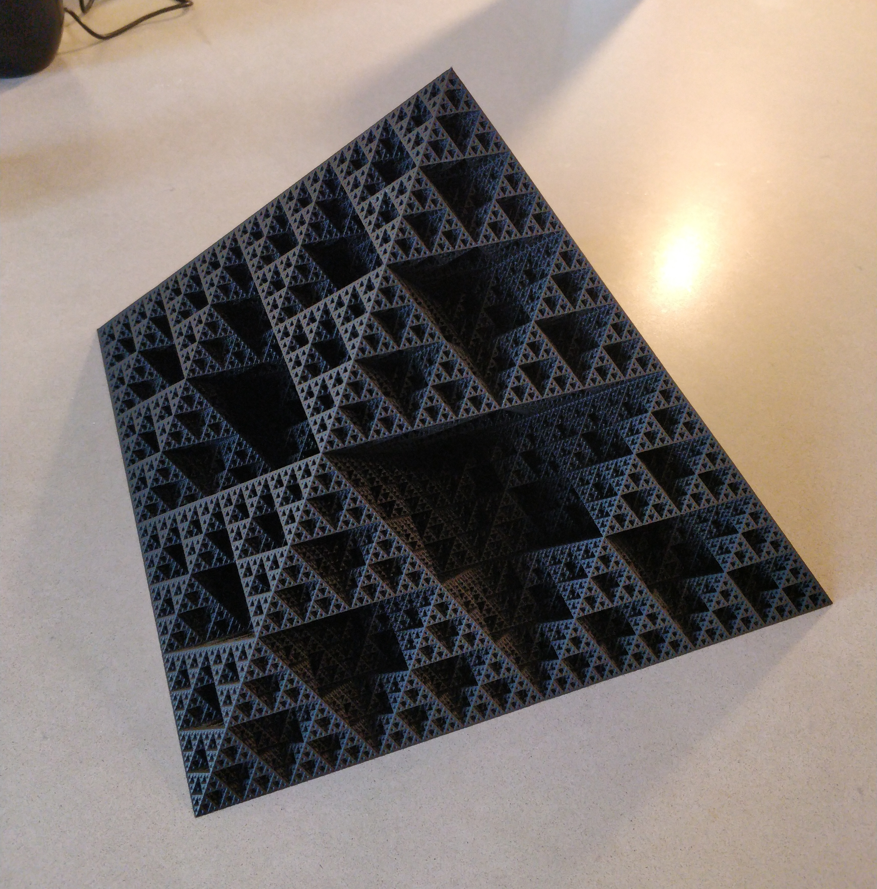

# sierpinski pyramid gcode generator

</img>

Skip to the [usage/tutorial](#usagetutorial) section if you just want to get printing.

- [sierpinski pyramid gcode generator](#sierpinski-pyramid-gcode-generator)
- [motivation](#motivation)
- [usage/tutorial](#usagetutorial)
- [see also/references](#see-alsoreferences)

# motivation
The sierpinski pyramid is a really cool fractal.
(Technically, it's more correctly referred to as the top-half of a sierpinski octahedron, but whatever)
It is formed by taking a "base case" object, and iterating it through a series of geometric transformations and clone operations.
Each iteration/order shrinks the previous one.
In the limit to infinity, it doesn't matter what shape you started out with, since it has been shrunk down to a point at each position.
(usually, if we're going to render or print it, we limit the number of iterations (also called the order) of the fractal, and we set the "base case" shape to be a simplified shape as the fractal, for consistency)
In the sierpinski pyramid, the base of the pyramid always has `2^i` sections, where `i` is the iteration (or order) of the fractal.

The sierpinski pyramid is uniquely well-suited for 3D printing, because it has a continuous cross section.
This means we can print it in vase mode, with no travel moves or retraction!

This fractal has other properties that make it hard to model in most CAD software and slicers, though.
1. It has very high surface area and very low volume (in the limit, it has infinite surface area and zero volume).
2. The different "mini-pyramids" are connected by infinitely thin sections.
3. The complexity is 6x more with each iteration of the fractal.

There are many 3D models to print of this fractal (see the references section below).
These all make valiant efforts to solve issues (1) and (2) mentioned above, but the issue of total complexity still remains.
**As of this writing, I have yet to find a 3D model of an iteration-7 sierpinski pyramid.**
(or a physical, 3d-printed one, for that matter)
It's just too complex to practically do.
(Most of these models are built with OpenSCAD, and it just crashes if you try to make an iteration-7 fractal)

So, my solution (implemented in this repository) is to simply skip the CAD and slicer steps! I do the fractal math, and then generate gcode directly from that.

# usage/tutorial
1. go to [the releases page](https://github.com/madewithlinux/sierpinski-pyramid-gcode/releases) and download the latest release for your platform
   * disclaimer: I have only tested the linux version. Windows and Mac (darwin) should work just fine, but I don't have a windows or mac computer, so...
2. you need a config yaml file.
  * **Config files are printer-specific (just like slicer profiles). Do not print from a config file that you do not trust!**
  * To make a config file for yourself, see [`example_config.yml`](example_config.yml) file in this repository
  * (also see https://yaml-multiline.info/ for a reference of multi-line string syntax in yaml files)
3. run the gcode generator: the config file name is the only command-line parameter
   * linux: `./sierpinski-pyramid-gcode.linux YOUR_CONFIG_FILE.yml`
   * windows: `sierpinski-pyramid-gcode.windows.exe YOUR_CONFIG_FILE.yml`
     * (you will need to run from command prompt, probably)
   * mac: `./sierpinski-pyramid-gcode.darwin YOUR_CONFIG_FILE.yml` (run from terminal)
4. print it!
   * keep in mind that, for high-order fractals, the gcode file will be large. E.g. an order 7 fractal is >500MB of gcode, and takes roughly 100+ hours to print. But it's doable!

# see also/references
* [Marlin gcode reference](https://marlinfw.org/docs/gcode/G000-G001.html)
* [Duet RepRapFirmware gcode reference](https://duet3d.dozuki.com/Wiki/Gcode)
* 3d models
  * https://www.thingiverse.com/thing:1356547
  * https://www.thingiverse.com/thing:2573402
  * https://www.thingiverse.com/thing:2613568
* https://github.com/Duet3D/RepRapFirmware/blob/2.03/src/Storage/FileInfoParser.cpp
